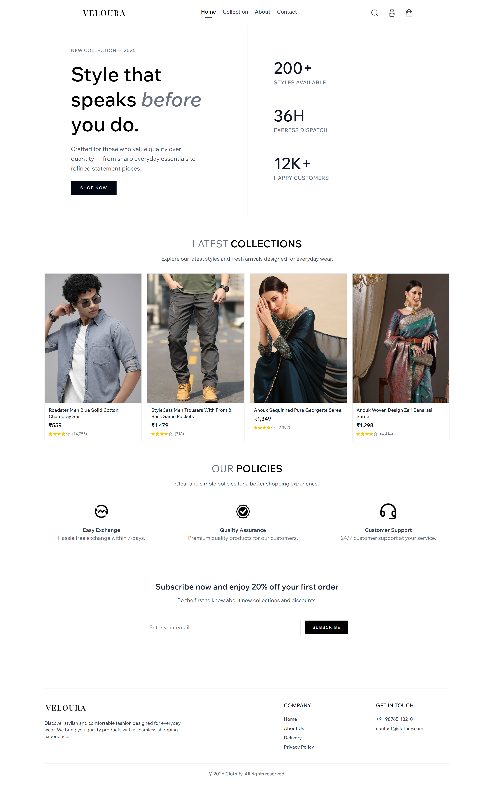
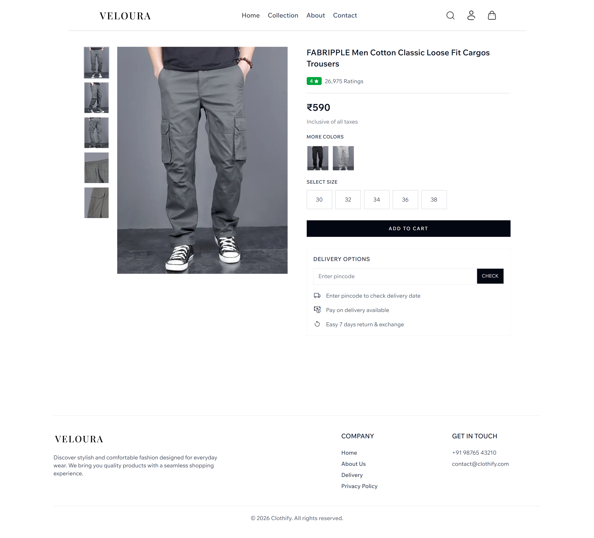
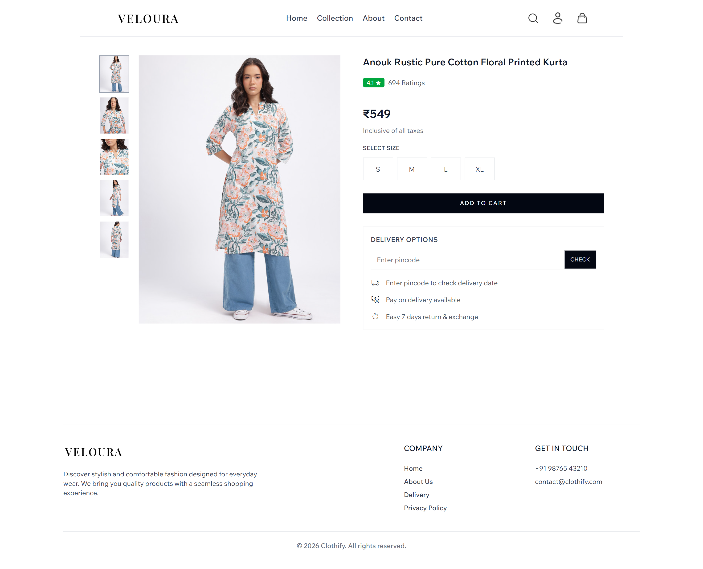
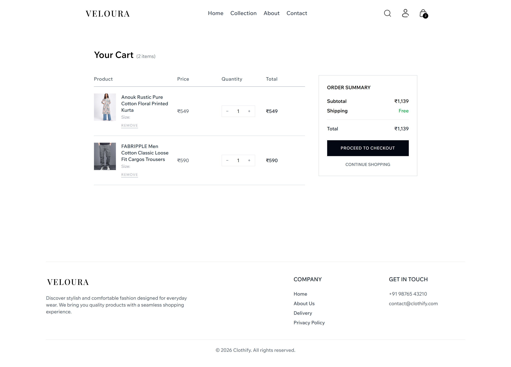
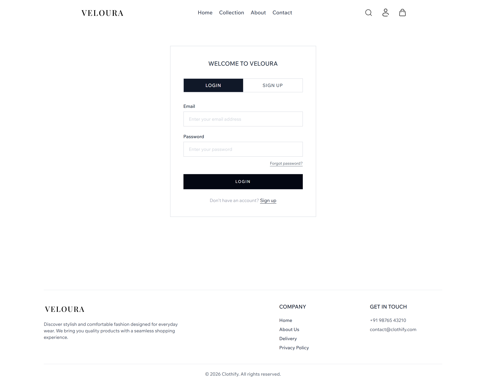
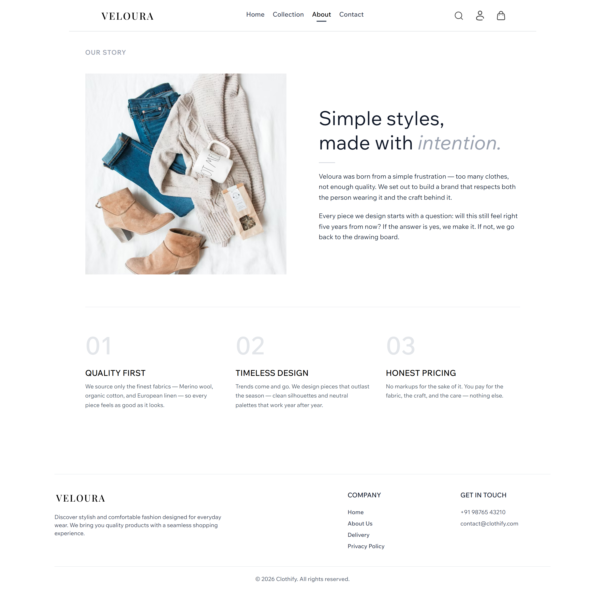
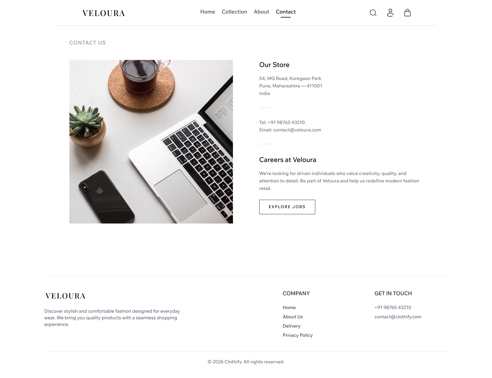
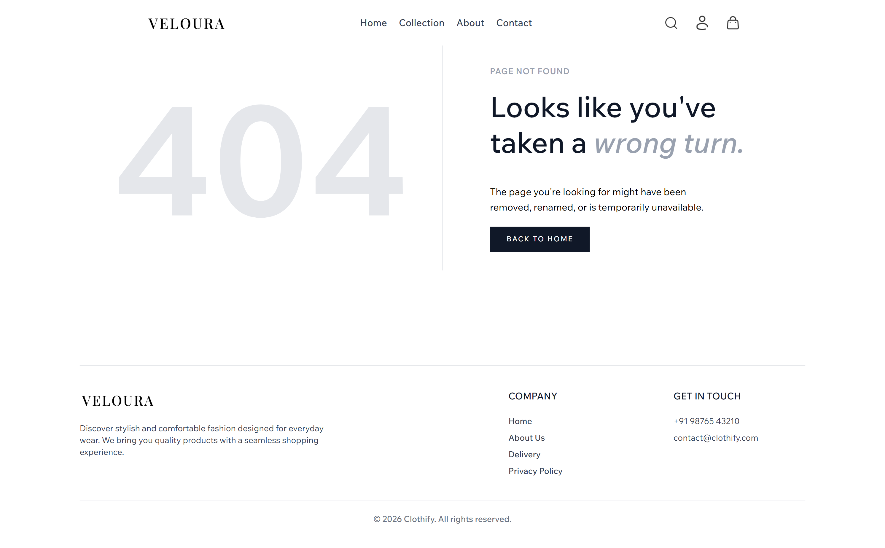

# Veloura — E-Commerce Clothing Store

Veloura is a fully functional, responsive e-commerce clothing store built with **React.js** and **Tailwind CSS**. It features a complete shopping experience including product browsing, variant selection, persistent cart management, and delivery options.

---

## Screenshots

| Home                                 | Collection                                       |
| ------------------------------------ | ------------------------------------------------ |
|  |  |

| Product (Men)                                       | Product (Women)                                     |
| --------------------------------------------------- | --------------------------------------------------- |
|  |  |

| Cart                                 | Login                                  |
| ------------------------------------ | -------------------------------------- |
|  |  |

| About                                  | Contact                                    |
| -------------------------------------- | ------------------------------------------ |
|  |  |

| 404 Not Found                            |
| ---------------------------------------- |
|  |

---

## Features

- Browse products with category filters, type filters, and sort options
- Select size and color variants with real-time price updates
- Stock indicator highlights low stock (below 5 units)
- Color variant images mapped dynamically from product data
- Slide-in cart drawer with quantity controls and order summary
- Full cart page with persistent cart saved to `localStorage`
- Delivery pincode checker with estimated delivery date
- Real-time search that filters the collection instantly
- Login and Sign Up toggle form
- Fully responsive across mobile, tablet, and desktop
- Custom 404 Not Found page

---

## Tech Stack

| Technology      | Purpose                                |
| --------------- | -------------------------------------- |
| React.js        | Component-based UI                     |
| Tailwind CSS    | Utility-first styling                  |
| React Router v6 | Client-side routing                    |
| Context API     | Global state management                |
| JSON Server     | Fake REST API for product data         |
| localStorage    | Cart persistence across sessions       |
| Bootstrap Icons | Icons for ratings and delivery section |

---

## Project Structure

```
veloura/
├── json-data/
│   └── db.json
├── public/
│   ├── images/          # All product and asset images
│   ├── favicon.svg
│   └── icons.svg
├── src/
│   ├── assets/
│   │   └── hero.png
│   ├── components/
│   │   ├── CartDrawer.jsx
│   │   ├── Footer.jsx
│   │   ├── Hero.jsx
│   │   ├── LatestCollection.jsx
│   │   ├── Navbar.jsx
│   │   ├── NewsLetter.jsx
│   │   ├── OurPolicy.jsx
│   │   ├── ProductItem.jsx
│   │   ├── SearchBar.jsx
│   │   ├── Title.jsx
│   │   └── TitleUpdater.jsx
│   ├── context/
│   │   └── ShopContext.jsx
│   ├── pages/
│   │   ├── About.jsx
│   │   ├── Cart.jsx
│   │   ├── Collection.jsx
│   │   ├── Contact.jsx
│   │   ├── Home.jsx
│   │   ├── Login.jsx
│   │   ├── NotFound.jsx
│   │   └── Product.jsx
│   ├── services/
│   │   └── api.js
│   ├── App.css
│   ├── App.jsx
│   ├── index.css
│   └── main.jsx
├── .gitignore
├── eslint.config.js
├── index.html
├── package.json
├── package-lock.json
├── README.md
└── vite.config.js
```

---

## Getting Started

### Prerequisites

Make sure you have the following installed:

- [Node.js](https://nodejs.org/) v18+
- npm

### 1. Clone the repository

```bash
git clone https://github.com/vanurag02/veloura.git
cd veloura
```

### 2. Install dependencies

```bash
npm install
```

### 3. Start the JSON Server

The product data is stored in `json-data/db.json`. Run JSON Server to serve it as a REST API on port 3000:

```bash
npx json-server --watch json-data/db.json --port 3000
```

### 4. Start the React app

Open a **new terminal** and run:

```bash
npm run dev
```

Open [http://localhost:5173](http://localhost:5173) in your browser.

> **Note:** Both the JSON Server (port 3000) and the React app (port 5173) must be running at the same time.
